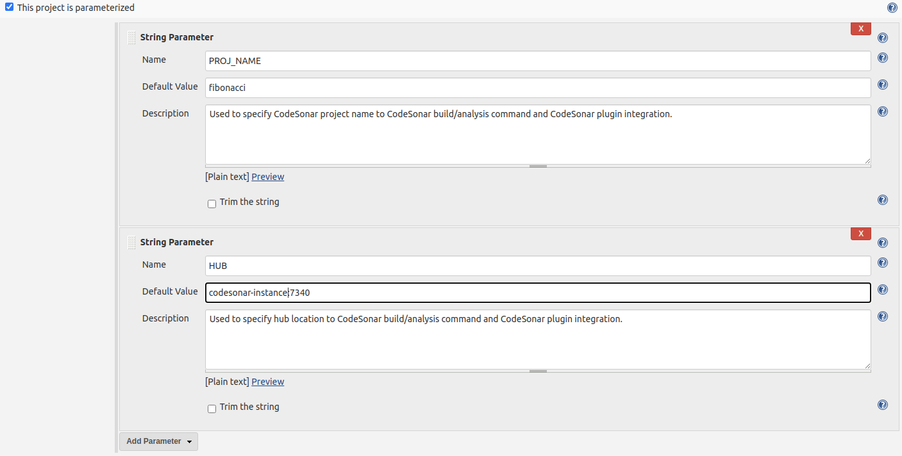
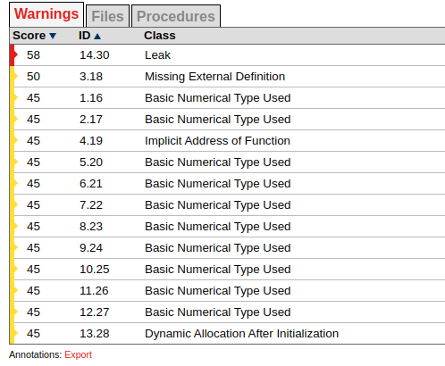
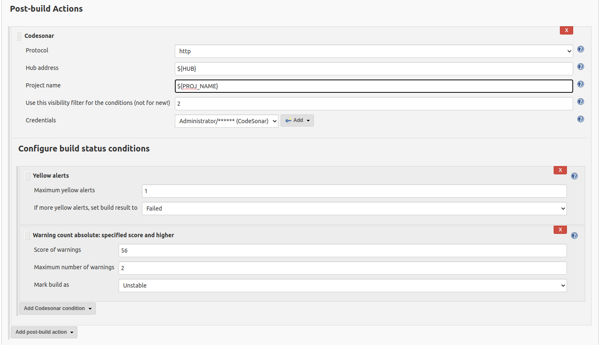
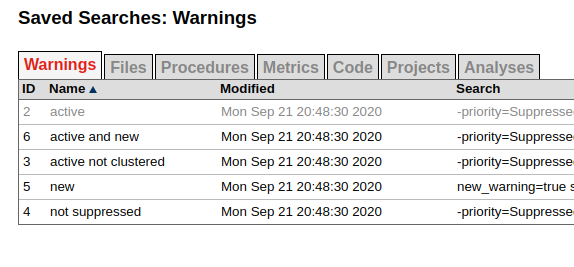

## About CodeSonar
[GrammaTech CodeSonar](https://www.grammatech.com/products/codesonar) GrammaTech's flagship static analysis software,
identifies programming bugs that can result in system crashes, memory corruption, leaks, data races, and security
vulnerabilities.

By analyzing both source code and binaries, CodeSonar empowers developers to eliminate the most costly and
hard-to-find defects early in the application development lifecycle.

## Introduction

The CodeSonar plugin collects project analysis data from a designated CodeSonar hub.

Historical data about CodeSonar warning counts and code size are presented in the Job Dashboard.

The plugin can be configured to change the build result if the CodeSonar analysis results meet specified conditions.
The following documentation cites relevant sections in the CodeSonar manual. These citations take the form:

**MANUAL**: **Subject** > ... > **Page Title**

where **Subject** > **....** > **Page Title** denotes a navigation path through the CodeSonar manual table of contents.

## Setting Up The Plugin

These instructions assume that you have:

* Installed Jenkins.
* Established a Jenkins job to build your software.
* Installed CodeSonar.
* Installed the CodeSonar plugin for Jenkins.

## Setting up the plugin involves three steps, each detailed below.

* Make sure CodeSonar is ready to analyze your software
* Incorporate the CodeSonar build/analysis in your Jenkins job
* Apply the CodeSonar plugin to your Jenkins job

### Make sure CodeSonar is ready to analyze your software
Work through the following steps to make sure that CodeSonar is in a suitable state to be invoked by your Jenkins job.

1. Make sure the path to `/codesonar/bin` is in the `PATH` of the user who is running Jenkins.
    * Otherwise, your codesonar analyze command will have to specify the path to the codesonar executable.
2. Please make sure that the launch daemon is running on the server. This needs to run as the user
   running Jenkins. It is encouraged to configured a [cronjob](https://en.wikipedia.org/wiki/Cron)
   for this
3. Start the CodeSonar hub to use for recording the analysis results (if it is not already running).
    * **MANUAL**: **How CodeSonar Works** > **CodeSonar Structure** > **Hub** > **Starting a Hub**
    * The remainder of these instructions will refer to the hub location as `host:port`.
4. Establish a project directory and project name for the CodeSonar project that will be built and analyzed.
    * If you have previously analyzed your software with CodeSonar, you can use the existing project infrastructure.
    * Otherwise, choose a project directory, and create the directory if it does not already exist.
      In either case, make sure the project directory has a suitable location and read/write settings.
      If Jenkins is running with different OS credentials to your own, remember to take this into account.
    * Use the same project directory and project name every time you perform the CodeSonar
      build/analysis for a given project.
    * The project directory should not be deleted at the end of the build: the CodeSonar GUI needs
      to interact with its contents, and incremental builds need information that is stored there.
        * Make sure the project directory is in a location where Jenkins will not automatically
          delete it after running the job. For example, it is probably a good idea to locate it
          outside the Jenkins workspace.
        * Similarly, take steps to ensure that your other build tools will not delete the project directory.
    * Set the project directory permissions to allow the Jenkins process to read and write to it.
    * The remainder of these instructions will refer to the project directory as `projdir` and the project name as `proj-name`.
    * If the project directory does not include a general project configuration file (for example, because you just created
      the directory in the previous step), create one now:<br>
        * `codesonar create-conf projdir/proj-name`
      **MANUAL: Using CodeSonar** > **Building and Analyzing Projects** > **Options, Preferences, and Configuration Files** > **Configuration Files**

5. Edit the general project configuration file (`projdir/proj-name.conf`) to specify your required
   configuration parameter settings (unless the factory settings are suitable).
    _MANUAL_: _Using CodeSonar_ > _Building and Analyzing Projects_ > _Options, Preferences, and Configuration Files_ >
        _Compiler-Independent Configuration File Parameters for CodeSonar_

In particular:
You may wish to specify one or more `CFLAGS_APPEND` rules.
If you are performing a clean build every time, set `INCREMENTAL_BUILD=No`.

6. Make sure there is a CodeSonar launch daemon running on the analysis machine, with the same owner as the Jenkins process.

MANUAL: How CodeSonar Works > Build and Analysis > cslaunchd: The CodeSonar Launch Daemon

If the analysis machine is running Windows, check to see whether there is a `cslaunchd` service on the
analysis machine, with the same owner as the Jenkins process. If not, set one up.

**MANUAL**: _Using CodeSonar_ > _Building and Analyzing Projects_ > _Continuous Integration_ > _Using CodeSonar With Continuous Integration Tools_

Note that if Jenkins is running as a service, its owner will usually be
`SYSTEM`.  Otherwise, arrange to start the launch daemon at system startup.
Go on to Incorporate the CodeSonar build/analysis in your Jenkins job.

### Incorporate the CodeSonar build/analysis in your Jenkins job

You will incorporate the CodeSonar build/analysis in your Jenkins job by
extending the current contents of the Build section as described in the following steps.

1. View the Job Dashboard for the Jenkins job that is building your software.
2. Click Configure to open the Job Configurations page.
3. Define a HUB parameter for the job, so you can use it both for the CodeSonar analysis invocation and to configure the CodeSonar plugin later:
    1. Make sure This build is parameterized is selected.
    1. Under This build is parameterized, click Add Parameter, then select String Parameter from the menu that pops up.
    1. Jenkins will display a set of fields for setting up your new parameter. Fill them out as follows.
        * Name: `HUB`
        * Default Value: the location (host:port) of your CodeSonar hub. For example, `alexhubmachine:7340`.
        * Description: you may want to enter a short description to remind yourself why you have this variable.
4. Use the same process to define a `PROJ_NAME` parameter whose value matches your established CodeSonar project name (proj-name).


5. Edit the Build section to integrate the CodeSonar build/analysis.
   Remember to specify authentication options in your build/analysis commands if they will be required by your hub.
   **MANUAL**: **How CodeSonar Works** > **CodeSonar Structure** > **Hub** > **Authentication and Access Control**

| Project Language | Editing the Build Section |
| :------------------|-------------------------------------------------------------------------------------------------------------------------------------------------------------------------------------------------------------------------------------------------------------------------------------------------------------------------------------------------|
| **C, C++**               | For every existing build step that involves C/C++ compilation, edit the build step to incorporate the CodeSonar build/analysis command. If the current build step or steps contain one command that involves C/C++ compilation, this will involve constructing a single codesonar analyze command. Otherwise there are two possible approaches: |
|                          | * Accumulate components into a CodeSonar project by constructing a codesonar build command for each software build command that involves C/C++ compilation, then add a final codesonar analyze command to analyze the project.                                                                                                                  |
|                          | *or*                                                                                                                                                                                                                                                                                                                                            |
|                          | Replace the text of the build step or steps with an invocation of a shell script or batch file with equivalent contents, then construct a single codesonar analyze command based on that invocation.                                                                                                                                            |
|                          | The codesonar analyze command must include the -foreground option.                                                                                                                                                                                                                                                                              |
|                          | See Example 1 and Example 2.                                                                                                                                                                                                                                                                                                                    |
| **Java**                 | Add a new, final build step that executes the CodeSonar Java build/analysis on the bytecode produced by the other build steps. The codesonar analyze command must include the -foreground option.                                                                                                                                               |
|                          | See Example 3.                                                                                                                                                                                                                                                                                                                                  |
|                          | *MANUAL*: Using CodeSonar > Building and Analyzing Projects  > Java > Build and Analysis for Java Projects                                                                                                                                                                                                                                      |
| **Mixed Java and C/C++** | Combine the approaches for Java-only and C/C++-only projects:                                                                                                                                                                                                                                                                                   |
|                          | 1. Edit the build steps to incorporate a codesonar build command for each software build command that involves C/C++ compilation.                                                                                                                                                                                                               |
|                          | 2. Add a new build step that executes codesonar build on any Java bytecode produced by earlier build steps.                                                                                                                                                                                                                                     |
|                          | 3. Add a new, final build step that invokes codesonar analyze to analyze the project.                                                                                                                                                                                                                                                           |
|                          |                                                                                                                                                                                                                                                                                                                                                 |
|                          | See Example 4 and Example 5.                                                                                                                                                                                                                                                                                                                    |

6. Click Save.
7. Check everything is working properly:
    1. Click Build with Parameters, check the parameter settings are correct, and click **Build**.
    2. Jenkins will execute the updated job.
      Check that the Jenkins job executed successfully, and check the job's Console Output to ensure that the build proceeded as you expected.
      * If necessary, click _Configure_ and adjust your edits, and make any other changes necessary to get your job running correctly.
      * If the CodeSonar build/analysis is not running to completion, the manual section on Troubleshooting the build may be helpful.
        MANUAL: Using CodeSonar > Building and Analyzing Projects > Troubleshooting the Build
    3. Open the CodeSonar GUI in your web browser and inspect your analysis results on the Analysis page.
       MANUAL: Using CodeSonar > GUI Reference > GUI Reference
8. Go on to Apply the CodeSonar plugin to your Jenkins job.

### Apply the CodeSonar plugin to your Jenkins job

Once your Jenkins job is correctly invoking the CodeSonar analysis, you can apply the CodeSonar plugin to collect
analysis information from the hub.

1. Go back to Job Configurations page for the Jenkins job that is building your software.
1. Under Post-build Actions, click Add post-build action, and select CodeSonar from the menu that pops up.
    * If CodeSonar is not a menu option, the plugin may not be installed.
1. Jenkins will display fields for you to configure this application of the plugin.
    1. Select the protocol used by your hub from the Protocol menu: either http or https.
    1. Enter `${HUB}` in the hub address field.
    1. Enter `${PROJ_NAME}` in the Project name field.
    1. Click the **Add** button next to the **Credentials** field, then fill in **Add Credentials** form that opens and click Add.
1. Set Kind to "Username with password" or "Certificate".
1. Set Scope to Global.
1. Use the remaining fields to specify the hub user account credentials that the plug-in should use in obtaining analysis information from the hub. See below for information about the permissions required and additional manual references.
1. These credentials will not be applied to the build/analysis commands you specified in the previous step. If you want to specify authentication credentials for those commands, use the appropriate command-line authentication options.
    **Optional** If you want to configure one or more "CodeSonar conditions", see the descriptions below.
1. Click Save.
    * The list of links at the left-hand side of the Job Dashboard will now include Latest CodeSonar Analysis link.
      This navigates to the CodeSonar GUI Analysis page for the most recently executed analysis of this project.
1. Please check if everything is working properly:
    1. Click Build with Parameters, check that the parameter settings are correct, and click Build.
       Jenkins will execute the updated job.
    1. Please check if the Jenkins job executed successfully, and check the job's Console Output to ensure that the build proceeded as you expected.
        * If necessary, click Configure and adjust your edits, and make any other changes necessary to get your job running correctly.
1. Notice that the dashboard now contains charts of "Total number of warnings" and "Lines of Code" (if it doesn't, reload the page). These charts represent CodeSonar analysis history for this project.

### Build Step Examples

These examples all assume the following:

* Build parameter `${HUB}` has been established and set to the hub location.
* Build parameter `${PROJ_NAME}` has been established and set to the CodeSonar project name.
* The project directory is `/myfiles/csonar_projects/projX`

#### Example 1: C/C++ project; Jenkins build steps include one command that involves C/C++ compilation.

Suppose that the Jenkins job build step text is:

```bash
cd /myfiles/src/projX && make normal
```

Then replace the build step text with:

```bash
cd /myfiles/src/projX && codesonar analyze /myfiles/csonar_projects/projX/${PROJ_NAME} -foreground ${HUB} make normal
```

#### Example 2: C/C++ project; Jenkins build steps include multiple commands that involve C/C++ compilation.

Suppose that the Jenkins job build step text is:

```bash
cd /myfiles/src/projX
rm -f *.o
gcc -c A.c
gcc -c B.c
gcc -c C.c
```

There are several possible approaches.

1.

```
cd /myfiles/src/projX
rm -f *.o
codesonar build /myfiles/csonar_projects/projX/${PROJNAME} -foreground  ${HUB} gcc -c A.c
codesonar build /myfiles/csonar_projects/projX/${PROJNAME} -foreground ${HUB} gcc -c B.c
codesonar build /myfiles/csonar_projects/projX/${PROJNAME} -foreground ${HUB} gcc -c C.c
codesonar analyze /myfiles/csonar_projects/projX/${PROJNAME} -foreground ${HUB}
```

1. Collect the build step text into a single shell script /path/to/dir/mybuildscript.sh:

```
cd /myfiles/src/projX
rm -f *.o
gcc -c A.c
gcc -c B.c
gcc -c C.c
```

then replace the build step text with:

```
cd /path/to/dir && codesonar analyze ${PROJNAME} -foreground ${HUB} sh -xe mybuildscript.sh
```

2. Collect the build step text into a single batch file path\to\dir\mybuildbat.bat:

```bash
cd \myfiles\src\projX
rm -f *.o
gcc -c A.c
gcc -c B.c
gcc -c C.c
```
then replace the build step text with:

```bash
codesonar analyze ${PROJNAME} -foreground ${HUB} path\to\dir\mybuildbat.bat
```

#### Example 3: Java project

Suppose that the Jenkins job writes Java build output to /myfiles/buildoutput/classes.

Then add a new "Execute shell" build step with the following contents.

```bash
codesonar analyze /myfiles/csonar_projects/projX/${PROJNAME} -foreground ${HUB} cs-java-scan /myfiles/buildoutput/classes
```

#### Example 4: Mixed C/C++ and Java project; single build command

Suppose that the Jenkins job build step text is:

```bash
cd /myfiles/src/projX
make all
```

and that the Jenkins job writes Java build output to `/myfiles/buildoutput/classes`.

#### Example 5: Mixed C/C++ and Java project; multiple build commands

Suppose the Jenkins job build step text is:

```bash
cd /myfiles/src/projX
rm -f *.o
rm -f *.class
gcc -c A.c
gcc -c B.c
javac J.java
```

and that the Jenkins job writes Java build output to /myfiles/buildoutput/classes.

There are several possible approaches.

1. Move the build text to a Makefile, shell script, batch file, or similar, then follow the approach illustrated in Example 4.   |
2. Replace the build step text with:

```bash
cd /myfiles/src/projX
rm  -f  *.o
rm  -f  *.class
codesonar build /myfiles/csonar_projects/projX/${PROJNAME} -foreground  ${HUB} gcc -c A.c
codesonar build /myfiles/csonar_projects/projX/${PROJNAME} -foreground ${HUB} gcc -c B.c
javac J.java
codesonar build /myfiles/csonar_projects/projX/${PROJNAME} -foreground ${HUB} cs-java-scan /myfiles/buildoutput/classes
codesonar analyze /myfiles/csonar_projects/projX/${PROJNAME} -foreground ${HUB}
```

## Configuration Settings

The CodeSonar plugin for Jenkins has two required configuration settings and a number of optional ones.

* Protocol, Hub address, Project name are always required.
* The Credentials setting is required if special user Anonymous does not have sufficient permissions to interact with
  the CodeSonar analysis information on the hub.
* Users can also specify zero or more CodeSonar conditions.

### Required Configuration Settings

| Setting Name     | Description                                                                                                    | Notes                                                                                                                                  |
|------------------|----------------------------------------------------------------------------------------------------------------|----------------------------------------------------------------------------------------------------------------------------------------|
| **Protocol**     | The protocol that should be used to communicate with the hub: either http or https.                            | Always explicitly specify https if you are concerned about security, otherwise you may be sending unencrypted data to an imposter hub. |
|                  | MANUAL: How CodeSonar Works > CodeSonar Structure > Hub > Hub Location                                         |                                                                                                                                        |
| **Hub address**  | The location of the CodeSonar hub that you are using to manage your analysis results, in format hostname:port. | If you have set up a `${HUB}` parameter for the job, you can use it here.                                                              |
|                  | MANUAL: How CodeSonar Works > CodeSonar Structure > Hub > Hub Location                                         |                                                                                                                                        |
| **Project name** | The CodeSonar project name.                                                                                    | If you have set up a `${PROJNAME}` parameter for the job, you can use it here.                                                         |
|                  | | |

### Optional Configuration Settings

The hub user account you specify here must have sufficient permissions to access the relevant analysis information.

The hub user account credentials that the plugin should use when obtaining analysis information from the hub.

* **MANUAL**: How CodeSonar Works > CodeSonar Structure > Hub > Hub User Accounts
* **MANUAL**: Role-Based Access Control (RBAC) > RBAC: Role-Permissions

#### Global permissions

You need to configure the CodeSonar user to have the following permissions.

* `G_LIST_PROPERTIES`
* `G_LIST_USERS`
* `G_SIGN_IN`
* `G_SIGN_IN_CERTIFICATE` or `G_SIGN_IN_PASSWORD`, depending on the **Kind of credentials** you are specifying.

#### Permissions on analyzed project `${PROJNAME}`

In addition, these permissions are needed for the project.

* `ANALYSIS_ANNOTATE`
* `ANALYSIS_EXISTS`
* `ANALYSIS_READ`
* `ANALYSIS_WARNING_EXISTS`
* `ANALYSIS_WRITE`
* `PROJECT_EXISTS`
* `PROJECT_READ`

* `NAMEDSEARCH_READ` for the following built-in warning searches: _active_, _new_, _active and new_.

You do not need to configure credentials if special user _Anonymous_ has sufficient permissions to obtain analysis information from the hub: in this case, the plugin will interact with the hub in an anonymous session (Anonymous does not need `G_SIGN_IN_CERTIFICATE` or `G_SIGN_IN_PASSWORD`).
Note that these credentials are not used to authenticate CodeSonar build/analysis commands issued by your Jenkins job.
If you want to specify authentication credentials for those commands, use the appropriate command line
authentication options.

## CodeSonar conditions

Users can specify zero or more CodeSonar conditions. Each condition specifies a bound on some particular
property of the CodeSonar analysis results, along with the build result setting to be applied if the property's
value lies outside the specified bound.

There are six different condition types.

* **Cyclomatic complexity**

One or more procedures has cyclomatic complexity (as determined by CodeSonar) that exceeds the specified limit.

**MANUAL**: How CodeSonar Works > CodeSonar Structure > Metrics

* **Red alerts**

The number of red alerts from CodeSonar analysis exceeds the specified limit. Please note that this has nothing to
do with the color in the margin of the warning page. Instead, you can see the specification in the manual
for when CodeSonar marks a warning as red. Please see the image under **Yellow alerts**.

**MANUAL**: Using CodeSonar > GUI Reference > Alerts

* **Warning count increase: new only**

The number of new warnings issued by the CodeSonar analysis exceeds the number issued for the previous analysis by more than the specified percentage.

**MANUAL**: How CodeSonar Works > CodeSonar Structure > Warnings > Warnings: Instances and Groups

* **Warning count increase: overall**

The number of warnings issued by the CodeSonar analysis exceeds the number issued for the previous analysis by more than the specified percentage.

**MANUAL**: How CodeSonar Works > CodeSonar Structure > Warnings > Warnings: Instances and Groups

* **Warnings count increase: specified score and higher**

The number of warnings in the specified score range issued by the CodeSonar analysis exceeds the number issued for the previous analysis by more than the specified percentage.

**MANUAL**: How CodeSonar Works > CodeSonar Structure > Warnings > Warnings: Instances and Groups

* **Yellow alerts**

The number of yellow alerts from the CodeSonar analysis exceeds the specified limit. Please note that this has
nothing to do with the color in the margin of the warning page. Instead, you can see the specification in the manual
for when CodeSonar marks a warning as yellow.

**MANUAL**: Using CodeSonar > GUI Reference > Alerts

### Note on yellow and red alerts

The red and yellow alerts in CodeSonar do not correlate to the red and yellow warning score coloring,
as shown in the following image.



Instead, you can see how many red and yellow warnings that CodeSonar found under an analysis in the
upper right corner. Yellow warnings are typically related to parse errors, while red warnings are a bit severe.
Please see the list when an alert will be marked as either red or yellow in the manual pages:

**MANUAL**: Using CodeSonar > GUI Reference > Alerts


## Configuration Example

With this configuration, the plugin will mark the build as "Failed" if the CodeSonar analysis produces one or more
red alerts or 2 or more warnings with a score of at least 56.



The visibility filter parameter `filter` can be found under `<hub url>/savedsearches.html?ssdomain=0`.
You may need to right-click to trigger the `id` column. The visibility filter that's used by default is
`active` (the filter with the id number `2`).

## Pipeline DSL

It's also possible to use the plugin with [Pipeline DSL](https://www.jenkins.io/doc/book/pipeline/syntax/)
The easiest way to get a usable template for your job is to use the
[snippet generator](https://www.jenkins.io/doc/book/pipeline/getting-started/#snippet-generator). This is a small
sample you may build upon:

```groovy
pipeline {
    agent any
    parameters {
        string (
            defaultValue: 'some-name',
            description: 'The name of the project in CodeSonar',
            name : 'JOB_NAME'
        )
        string (
            defaultValue: '127.0.0.1:7340',
            description: 'The default address of the CodeSonar hub',
            name : 'HUB'
        )
    }
    stages {
        stage('build and analyze') {
            steps {
                // run the codesonar analyze commands ...
                script {
                    codesonar conditions:
                        [warningCountIncreaseSpecifiedScoreAndHigher(rankOfWarnings: 55, warningPercentage: '3')],
                            credentialId: '....', hubAddress: '${HUB}', projectName: '${JOB_NAME}', protocol: 'http',
                            filter: '2'
                }
            }
        }
    }
}
```

The credential id can be found in **Manage Jenkins** -> **Credentials**. It's a UUID-ish string.

The visibility filter parameter `filter` can be found under `<hub url>/savedsearches.html?ssdomain=0`.
You may need to right-click to trigger the `id` column.



## Jenkins Job DSL

Available options

```jenkins
job{
    publishers{
        codeSonar(String hubAddress, String projectName){
            cyclomaticComplexity(int maxComplexity, boolean markAsFailed)
            redAlert(int maxAlerts, boolean markAsFailed)
            yellowAlert(int maxAlerts, boolean markAsFailed)
            newWarningCountIncrease(float percentage, boolean markAsFailed)
            overallWarningCountIncrease(float percentage, boolean markAsFailed)
            rankedWarningCountIncrease(int minRank, float percentage, boolean markAsFailed)
        }
    }
}
```
Example

```jenkins
job('myProject_GEN'){
    publishers{
        codeSonar('hub','proj'){
            cyclomaticComplexity(20, false)
            redAlert(3, true)
            yellowAlert(10, false)
            newWarningCountIncrease(5, true)
            overallWarningCountIncrease(5, false)
            rankedWarningCountIncrease(30, 5, true)
        }
    }
}
```

## Support and Contact
Please send an email on [support@praqma.net](mailto:support@praqma.net) if you have a request or question regarding the plugin.
